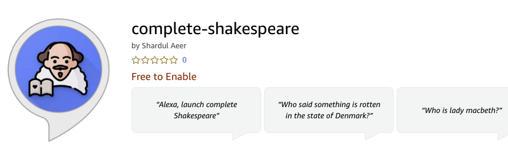
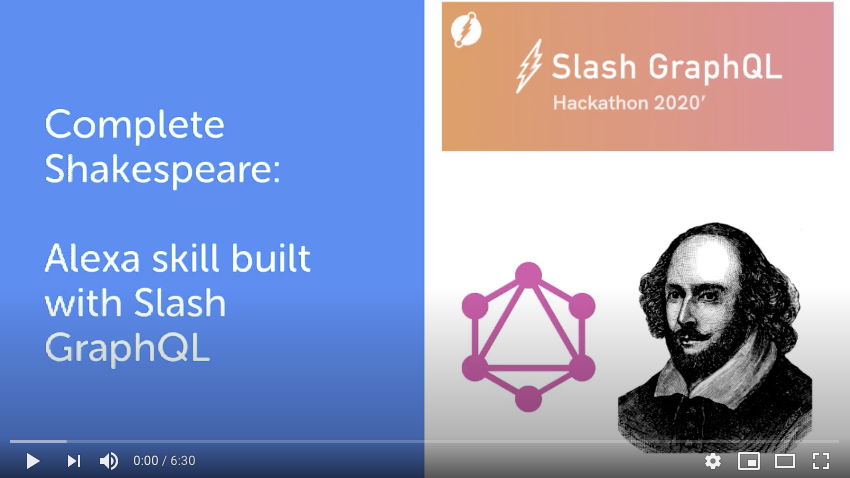
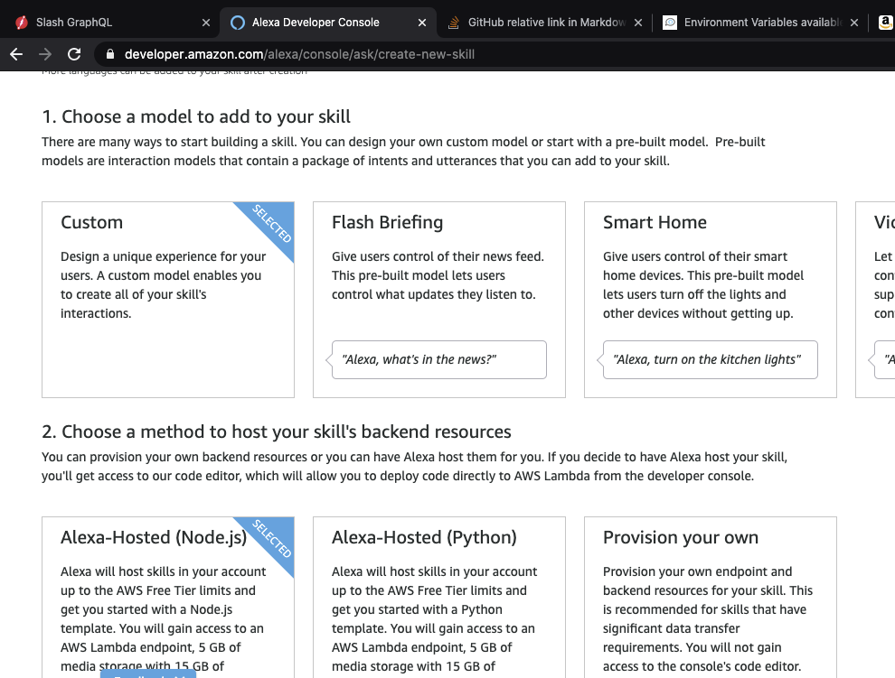
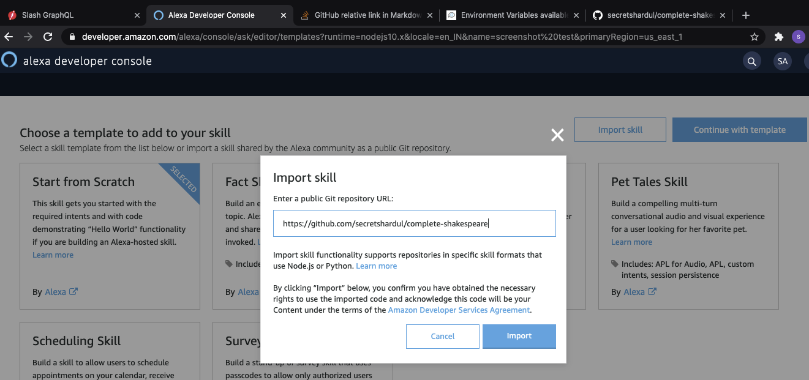
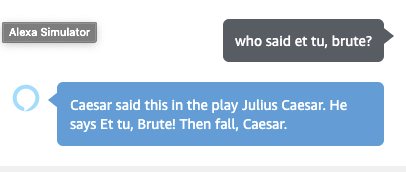
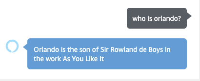
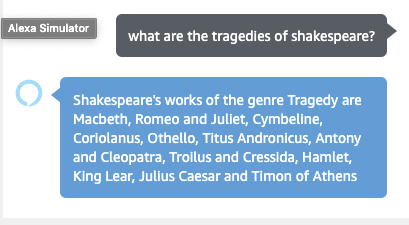
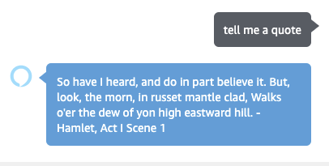

# Complete Shakespeare Alexa skill


Alexa skill that queries the works of Shakespeare from Dgraph's Slash GraphQL database.

This project is split across 3 repositories:
1. [**dgraph-shakespeare-data**](https://github.com/secretshardul/dgraph-shakespeare-data): Contains the RDF file and GraphQL schema needed to setup DGraph.
2. [**complete-shakespeare**](https://github.com/secretshardul/complete-shakespeare) (current repository): Contains code for Alexa skill.
3. [**GraphiQL explorer**](https://github.com/secretshardul/shakespeare-api)

## GraphiQL explorer
https://secretshardul.github.io/shakespeare-api/

## Update: the skill is live on Amazon


[Install link](https://www.amazon.in/dp/B08MTC49FQ/ref=sr_1_1?dchild=1&keywords=complete+shakespeare&qid=1604572645&s=digital-skills&sr=1-1)


## Demo video
[](https://youtu.be/CpnAH6ymal8)
The demo was recorded when the skill was pending approval. The skill is now live. You can directly test it on your Alexa device without going to the Alexa console.

## Architecture


## Instructions to run code
These steps are for building the skill from its code.

## Setup Dgraph database (optional)
1. Follow instructions from [**dgraph-shakespeare-data**](https://github.com/secretshardul/dgraph-shakespeare-data) repository to setup your Dgraph database on Slash.
2. Fork this repository.
3. Find the GraphQL endpoint in [`lambda/api.js`](lambda/api.js) and replace it with your own.
4. Commit changes and  push to github.

Alternately you can use my repository and skip the above steps. The endpoint `https://lowly-statement.ap-south-1.aws.cloud.dgraph.io/graphql` is provided in code. The slash cluster for this endpoint is up and running.

## Setup Alexa skill
1. Sign up on [Alexa developer portal](https://developer.amazon.com/en-IN/alexa/alexa-skills-kit)
2. Create new skill: Set model to custom and set hosting method to Alexa hosted(Node.js). Give the skill any name of your choice. Set the default language to **English(IN)** (this is important). Press create skill.

3. In the **choose a template** screen, press import skill button. Pass the link to this repository `https://github.com/secretshardul/complete-shakespeare.git`. Alternately if you created your own backend, pass the link of your forked repo. The link must end with `.git`.


4. **Change invocation name**: Go to build > invocation > add the name `complete shakespeare`. Press save and build buttons.
5. To test this skill: Go to test menu and change `Skill testing is enabled in` option to **development**.

# Usage
Invoke the skill by saying or typing **complete shakespeare**. Currently the skill has 4 intents:
1. Who said what and where?

    Valid inputs:
    ```
    "who said {phase}"
    "who said the phase {phase}"
    ```

    Eg. Who said et tu, Brute?

    

2. Who is the character X?

    Valid inputs:
    ```
    "who is {name}"
    "who is the character {name}"
    ```

    Eg. who is Orlando?

    

3. List the works from a particular genre:

    The genres are history, tragedy, comedy, poem and sonnet. The genre word is stemmed, so "what are the tragedies of shakespeare" is valid input.

    Valid inputs:
    ```
    "what are the {genre} of shakespeare",
    "tell me about the {genre} of shakespeare",
    "list the {genre} of shakespeare",
    "list the works of shakespeare of the genre {genre}",
    "what are the works of shakespeare of the genre {genre}"
    ```

    Eg. What are the tragedies of Shakespeare?
    

4. Tell a random quote:

    Valid inputs are of formats:
    ```
    "quote",
    "tell me a quote",
    "tell me a shakespeare quote",
    "shakespeare quote"
    ```

    Eg. Tell me a quote
    

# Code structure
1. [/lambda](/lambda): It contains `Node.js` code. This is executed by AWS Lambda when Alexa sends an intent. AWS Lambda generates the output message and passes it to Alexa for speech generation.
2. [/skill-package/interactionModels/custom/en-IN.json](/skill-package/interactionModels/custom/en-IN.json): Contains the intents and slots.

# Caveats
1. For the same email, Alexa hosted skill resources are hosted separately from your AWS account.
2. Environment variables are not supported in AWS hosted skills. Endpoint needs to be hard coded.
3. A separate git repository is created in AWS Codecommit when code is imported from git. Any code changes go here and they remain separate from your Github repository.
